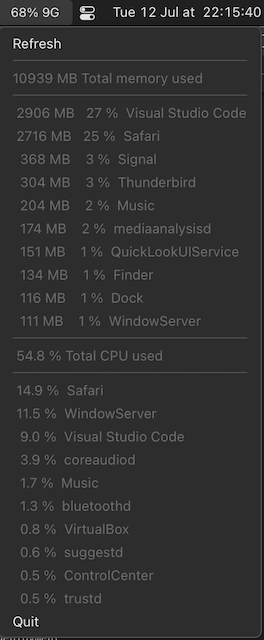

# macOS

## Busy

An applet showing CPU and memory usage.


100% = 1 core, 1G = 1GB



### Installation

#### Binary

[https://github.com/xpetit/macos/releases/latest](https://github.com/xpetit/macos/releases/latest)

#### From source

```
git clone https://github.com/xpetit/macos.git
cd macos
go build -o busy/Busy.app/Contents/MacOS/busy ./busy
```

The application "Busy.app" is in the folder `macos/busy`.

#### Run automatically at startup

Open Preferences, Users & Groups, Login items, Add "Busy.app".
